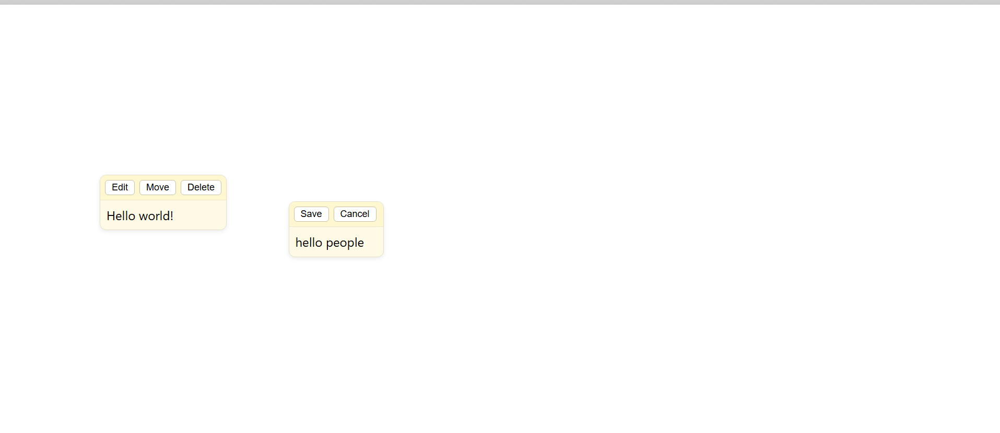

# Smart Notes

Smart Notes is a lightweight, draggable notes application built with HTML, CSS, and JavaScript. It lets you create, move, and save notes directly in your browser using local storage. Perfect for quick credentials, ideas, or snippets - with a simple one-click copy feature.

## Features
- Create, edit, delete, and move notes with drag-and-drop.
- Local storage persistence so notes stay even after refresh.
- Quick copy of selected text inside individual notes.
- Auto-focus for new notes for faster writing.
- Multi-line notes support with real-time drag snapping.

## How to Use
1. Click anywhere on the board to create a new note.
2. Type your text and save it; notes are saved automatically.
3. Select any text inside a note to copy it instantly.
4. Move notes freely; positions and content are saved in your browser.

## Screenshots

## Live Demo
Try the app on [GitHub Pages](https://alihussain-hsp.github.io/smart-notes/).

## Author
Created by **Ali Hussain** - Full-stack Laravel & JavaScript Developer.  
Connect with me on [GitHub](https://github.com/alihussain-hsp).

## License
This project is open-source under the MIT License.
